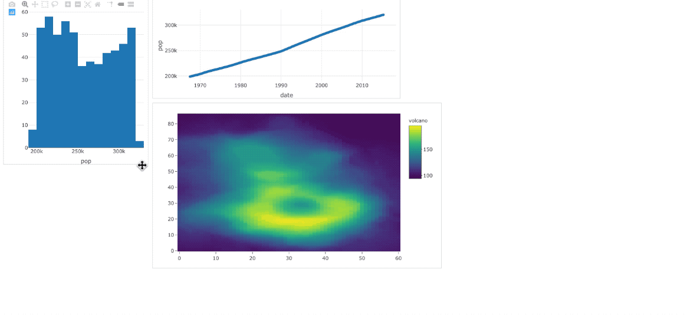

<!-- README.md is generated from README.Rmd. Please edit that file -->

# unlayout

<!-- badges: start -->

<!-- badges: end -->

Hmm, I’m just not there yet for laying out plots when doing EDA, and
hence `unlayout()` first (and drag them towards a better layout ;)).

This package is an html widget that simply wraps the `draggable()`
method from the [interact.js](https://interactjs.io) library. It works
with or without Shiny.

## Installation

You can install the dev version of unlayout from Github with:

``` r
# install.packages("remotes")
remotes::install_github("earowang/unlayout")
```

## Get started

``` r
library(unlayout)
library(plotly)
p1 <- plot_ly(economics, x = ~ pop, width = 350)
p2 <- plot_ly(economics, x = ~ date, y = ~ pop, height = 240, width = 600)
p3 <- plot_ly(z = ~ volcano)
unlayout(p1, p2, p3)
```



## Related works

Please check out [shinyjqui](https://github.com/Yang-Tang/shinyjqui) for
rich interactable features, including draggable, resizable, and
sortable.
